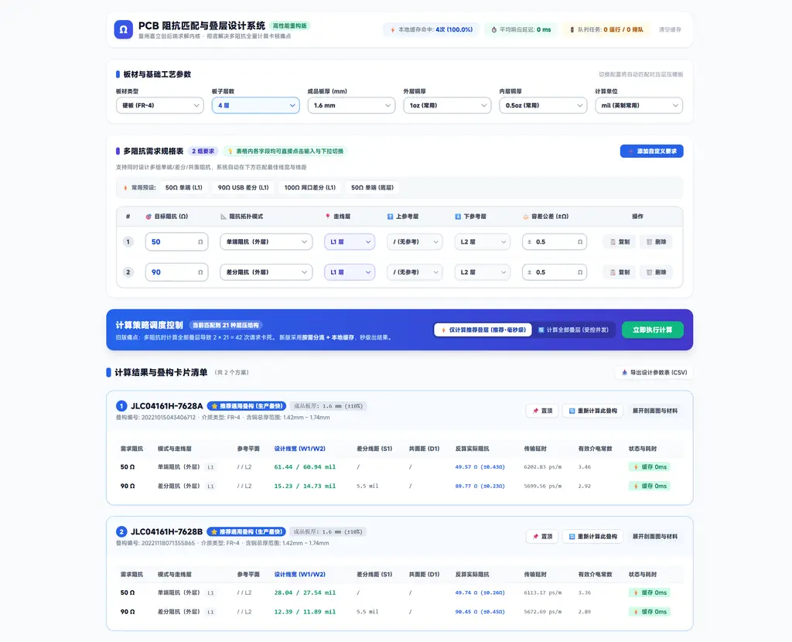
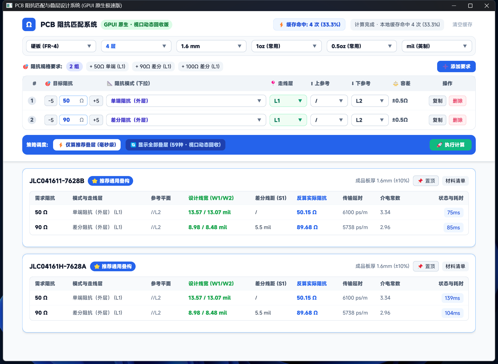

# PCB 阻抗匹配与高速叠层设计系统 (统一工程)

本项目复用嘉立创（JLC）后端求解内核，彻底解决原版系统在多阻抗全量计算时的 UI 卡顿与网络风暴问题。工程已整合归纳为双轨并行的单一整洁目录。

---

## 🌐 Web 在线体验

在线访问：[https://pcb-impedance-web.vercel.app/](https://pcb-impedance-web.vercel.app/)

---

## 🌐 Web 版本界面预览



---

## 🖥️ 界面预览 (GPUI 原生极速版)



---

## 📁 目录结构总览

```text
pcb-impedance/
├── start_desktop.bat      # 🚀 一键启动 GPUI 原生极速桌面端
├── start_web.bat          # 🌐 一键启动 Web 验证原型服务 (http://localhost:3000)
├── README.md              # 整个项目架构与使用说明
│
├── desktop/               # [核心成果] 基于 Rust + GPUI 的工业级原生桌面应用
│   ├── Cargo.toml         # Rust 依赖与构建配置
│   ├── src/
│   │   ├── main.rs        # 入口文件 (~100行)：窗口生命周期与视图主装配
│   │   ├── app.rs         # 应用核心状态机、默认叠构预热与后台异步计算调度
│   │   ├── api.rs         # JLC 后端接口交互与离线几何求解器
│   │   ├── cache.rs       # 线程安全本地 LRU 阻抗缓存
│   │   ├── models.rs      # 数据契约模型定义 (BoardConfig, StackupTemplate 等)
│   │   └── views/         # 模块化 UI 组件库
│   │       ├── mod.rs             # 组件统一导出
│   │       ├── header.rs          # 顶部标题栏、实时缓存监控与清空缓存
│   │       ├── board_params.rs    # 6 组板材/层数/板厚/铜厚/单位参数选择框
│   │       ├── requirements.rs    # 阻抗需求规格表：预设快捷按钮、可输入修改目标阻抗
│   │       ├── strategy_bar.rs    # 策略调度栏 (仅算推荐 / 显示全部59种 / 立即计算)
│   │       └── stackup_card.rs    # 动态回收叠构卡片、结果对比表、折叠材料参数清单
│   └── target/debug/      # 已编译生成的原生独立二进制文件 (pcb-impedance-gpui.exe)
│
├── web/                   # [验证原型] 基于 Node.js + Vue 3 的轻量 Web 原型 (保留版本)
│   ├── server.js          # 原生零依赖代理服务 (解决 CORS 跨域限制)
│   ├── package.json       # 项目配置 (含 npm start / dev)
│   ├── start_web.bat      # Web 专属启动脚本
│   └── public/            # 前端静态单页面 (Tailwind CSS + Vue 3 响应式界面)
│
└── tools/                 # 自动化测试与全景截图辅助脚本
    ├── capture_top.ps1    # Win32 DPI 感知高分辨率窗口全貌截图脚本
    ├── screenshot.ps1     # 自动化聚焦与捕获验证脚本
    └── run_capture.ps1    # 后台调试日志追踪脚本
```

---

## ⚡ 快速启动指南

### 1. 启动 GPUI 原生桌面应用（推荐主力版本）
* **方式 A**：直接双击根目录下的 `start_desktop.bat`；
* **方式 B**：双击已编译好的二进制文件：
  ```text
  desktop\target\debug\pcb-impedance-gpui.exe
  ```
* **特性**：
  * **0 毫秒秒开**：启动即呈现预热默认推荐叠构，无白屏卡顿；
  * **真·视口回收**：59 种叠构滑动丝滑 60/120fps，仅渲染可见卡片；
  * **居中自适应**：自动适配高 DPI 大屏，内容严格居中对齐、无右侧裁切；
  * **直接键盘输入**：支持点击目标阻抗直接输入修改任意阻抗数值（失焦自动保存）。

### 2. 启动 Web 验证原型（对照验证）
* **方式 A**：直接双击根目录下的 `start_web.bat`；
* **方式 B**：在 `web/` 目录下运行命令行：
  ```bash
  npm start
  ```
  在浏览器访问 `http://localhost:3000` 即可使用。
